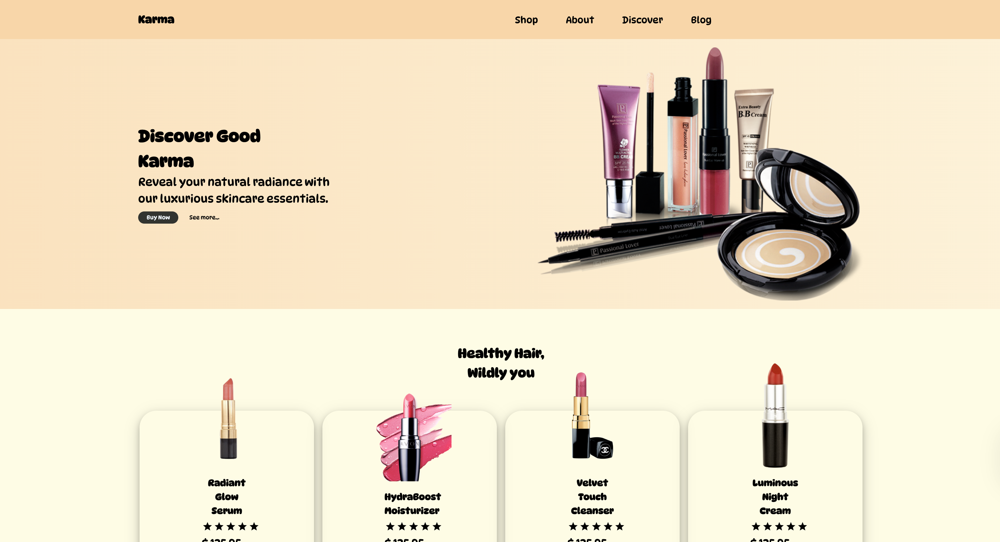

# Cosmetics Marketing Page



A visually stunning, interactive cosmetics marketing landing page built with React, GSAP, Lenis, and Three.js. This project demonstrates advanced UI/UX, scroll-based storytelling, 3D/2D animation, and modern web best practices.

---

## ✨ Features

- **Hero Section:**
  - Animated headline (split-text reveal)
  - 3D floating product (Three.js)
  - Parallax background and animated sparkles
  - Real product image
- **Animated Navbar:**
  - Smooth fade-in and staggered menu animation
- **Product Cards:**
  - Scroll-triggered split-text animation
  - 3D tilt effect on hover
- **Buy Now Buttons:**
  - Dramatic scale-up on hover
- **LowerPage2:**
  - Animated sparkles/circles
  - Parallax effect on product images
  - Opposite-direction content entrance
- **LowerPage3:**
  - Zoom-in, parallax, and floating elements
- **Footer:**
  - Animated entrance
  - Social/contact icons
- **Smooth Scrolling:**
  - Powered by Lenis
- **Fully Responsive & Mobile Friendly**

---

## 🚀 Tech Stack

- **React** (functional components, hooks)
- **GSAP** (ScrollTrigger, advanced animation)
- **Lenis** (smooth scrolling)
- **Three.js** (3D product in hero)
- **Remix Icon** (iconography)
- **SCSS** (modular, maintainable styles)

---

## 🛠️ Getting Started

1. **Clone the repo:**
   ```bash
   git clone https://github.com/your-username/cosmetics_marketing_page.git
   cd cosmetics_marketing_page
   ```
2. **Install dependencies:**
   ```bash
   npm install
   # or
   yarn install
   ```
3. **Start the development server:**
   ```bash
   npm start
   # or
   yarn start
   ```
4. **Open in your browser:**
   Visit [http://localhost:3000](http://localhost:3000)

---

## 🖌️ Customization

- **Product Images:**
  - Replace images in `src/assets/images/` for your own products.
- **3D Model:**
  - Swap the Three.js cube for a GLTF/GLB model for a real product showcase.
- **Colors & Branding:**
  - Edit SCSS files for your brand palette.
- **Content:**
  - Update text, links, and icons in the respective component files.

---

## 📦 Folder Structure

```
src/
  components/
    Button/
    Footer/
    LowerPage1/
    LowerPage2/
    LowerPage3/
    Navbar/
    UpperPage/
  assets/
    images/
  styles/
    App.scss
  App.js
  index.js
```

---

- Built with ❤️ by Pradeep Chaurasia and AI.

---

## 📬 Contact
- [LinkedIn](https://www.linkedin.com/in/pradeepchaurasia93)
- [GitHub](https://github.com/chaurasiapk)
- [Portfolio](https://chaurasiapk.github.io/profile)
- Email: chaurasia.pk6@gmail.com
